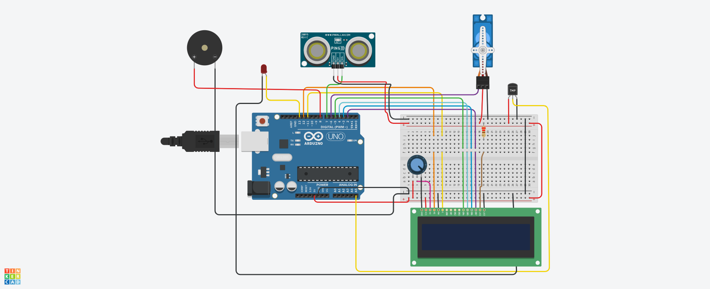
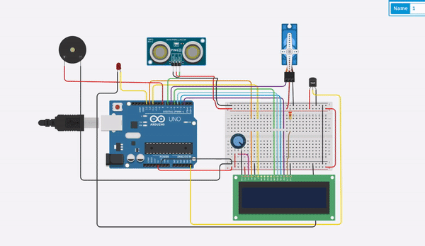

# COVID-Safe-Entry-Solution-with-Automated-Door-
Smart Door Opening System with temperature  and distance sensor

The project is designed for an automatic door-opening system using Distance and
Temperature Sensor. This project not only gets rid of the risk of allotting a person to check the temperatures of people entering the building but also creates a safe environment and reduces the risk of spreading of the covid -19
and is a step towards the normal situation. This is achieved with the help of Distance and
Temperature Sensor This sensing signal is fed to a microcontroller to operate a door motor through the motor driver IC. When a body approaches within the operating range of the sensor, it sends a logical command to open the door. The door automatically closes with a fixed time delay. 

[](https://www.arduino.cc/)


## Features

- Easy to Implement
- Fully Automatic
- Safe and Extensible
- Ease of Access
- Durable and Future proof

## Installation
### Requirements


| Quantity | Apparatus |
| ------ | ------ |
| 1 | [Breadboard](https://amzn.eu/d/6m54xhz)|
| 1 | [Arduino Uno Board](https://store.arduino.cc/products/arduino-uno-rev3/)|
| 1 | [Ultrasonic Distance Sensor](https://amzn.eu/d/ik9DgVk)|
| 1 | [Micro Servo](https://amzn.eu/d/8FxPWJT)|
| 1 | [Temperature Sensor(TMP 36)](https://www.tanotis.com/products/genuine-sparkfun-temperature-sensor-tmp36)|
| 1 | [Piezo](https://sensorkit.arduino.cc/sensorkit/module/lessons/lesson/04-the-buzzer)|
| 1 | [LCD 16x2](https://www.amazon.in/Generic-JCE-16X2-Lcd-Display/dp/B00OVY28M4)|
| 1 | [potentiometer](https://www.amazon.in/dp/B07L3VW43Y?_encoding=UTF8&psc=1&ref_=cm_sw_r_cp_ud_dp_6NYQPQWW6699TDS63GBZ)|
| 1 | [LED](https://amzn.eu/d/dDvKjQi)|
| ----- | [Connecting Wires](https://amzn.eu/d/7YOgh7g)|

## Online Simulator 
[](https://www.tinkercad.com/)

[](https://nodesource.com/products/nsolid)

### Circuit 



## Deployment
`LiquidCrystal.h`

`Servo.h`


```bash

  import the above library 
  And configure all the pins correctly
  Check the main.ino for full code

```

## Running Demo Video



## Feedback

If you have any feedback, please reach out to us at @rocksonu12345@gmail.com


